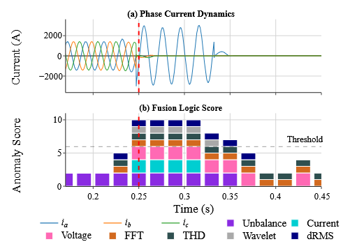

<div align="center">

# Fault Inception Detection in Real-World Disturbance Data

[](https://ieee-isgt-europe.org/)
[](https://arxiv.org/abs/2606.23111)
[](LICENSE)
[](https://www.python.org/)

**Training-free, physics-guided detection of fault inception timestamps (t₀) in large Digital Fault Recorder (DFR) archives.**

Official reference implementation of our ISGT Europe 2026 paper.
[📄 Paper](https://arxiv.org/abs/2606.23111) · [Cite this work](#-citation)

</div>

> **What it does:** estimates the onset time of genuine faults in real
> transmission recordings — distinguishing them from switching, transformer
> energization, resonance, and measurement artifacts — **without any training
> data or labels**. Validated on **12,053** RTE recordings; on a **300-event**
> manually reviewed subset it reaches **96.6 % recall**, **79.2 % precision**,
> and a **4.2 ms** median timing error.

> Accepted at the 2026 IEEE PES Innovative Smart Grid Technologies Europe
> (ISGT Europe), Oct 19–22 2026, Budapest, Hungary.

---

## How it works

A four-stage, glass-box pipeline — every trigger is interpretable:

1. **Preprocessing** — ADC→physical units, demean/detrend, cycle-synchronous
   windowing (6400 Hz, 50 Hz, 128 samples/cycle).
2. **Feature extraction** — per-cycle RMS, symmetrical components (I₀/I₁/I₂),
   THD, high-frequency energy, wavelets, dI/dt.
3. **Robust baseline modeling** — median/MAD modified Z-scores over a pre-event
   window, so a large disturbance can't mask itself.
4. **Hybrid detection** — a sub-cycle fast transient path (zero-sequence
   residuals + current derivatives) fused with cycle-synchronous triggers under
   persistence constraints and veto logic for non-fault transients.

Output: an estimated onset time **t₀** per event, with the contributing flags.
Full derivation and evaluation are in the [paper](https://arxiv.org/abs/2606.23111).

---

## Repository structure

```
fusion_fault_inception_detection/        # the installable package
  robust_fault_inception_detector.py       # main detector → t₀
  baseline_didt.py                          # dI/dt threshold baseline
  baseline_negative_sequence.py             # negative-sequence (R2) baseline
scripts/
  evaluate_baselines.py                     # detector vs. manual-label metrics
  export_summarized_fault_debug_events.py   # IEEE figure export
evaluation/manual_validation/             # 300-event manual-review pipeline
data/
  raw/        # place DATA_S.npz here (not included — download from RTE)
  interim/    # subset selection, Label Studio tasks
  processed/  # detector outputs & evaluation CSVs
figures/      # example + paper figures
```

---

## Installation

Requires **Python 3.10+**.

```bash
git clone <repo-url>
cd fault-inception-detection
pip install -e .
```

This installs the runtime dependencies (`numpy`, `pandas`, `PyWavelets`).
Optional extras:

```bash
pip install -e ".[dev]"          # plotting/figures (plotly, kaleido), formatters
pip install -e ".[labelstudio]"  # manual-review annotation pipeline
```

> **Note:** large CSV/figure artifacts are tracked with **Git LFS**. Run
> `git lfs pull` to fetch them (otherwise they appear as small pointer files).

### Dataset

The RTE Digital Fault Recording Database is **not bundled**. Download it from
<https://github.com/rte-france/digital-fault-recording-database> and place the
archive at:

```
data/raw/DATA_S.npz
```

---

## Quickstart

Run the detector from the repository root:

```bash
python -m fusion_fault_inception_detection.robust_fault_inception_detector
```

It reads `data/raw/DATA_S.npz` and writes per-event results to:

```
data/processed/robust_fault_inception_results.csv
```

Columns include `event_idx`, `fault_start_s` (estimated t₀), `fusion_score_at_start`,
the per-feature trigger flags (`flag_negseq`, `flag_zeroseq`, `flag_thd`,
`flag_wavelet`, …), `fast_path_activated`, and the veto indicators.

---

## Baselines

Two reference detectors from the paper, run the same way:

```bash
python -m fusion_fault_inception_detection.baseline_didt
python -m fusion_fault_inception_detection.baseline_negative_sequence
# → data/processed/baseline_didt_results.csv
# → data/processed/baseline_negative_sequence_results.csv
```

---

## Reproducing the evaluation

The **300-event manual-review pipeline** used in the paper, in order:

```bash
# 1. Detect on all events (produces robust_fault_inception_results.csv)
python -m fusion_fault_inception_detection.robust_fault_inception_detector

# 2. Stratified sampling of 300 events for review
python evaluation/manual_validation/select_subset_of_samples.py

# 3. Export per-event waveforms (+ symmetrical components) for annotation
python evaluation/manual_validation/extract_verification_events.py

# 4. Build Label Studio annotation tasks
python evaluation/manual_validation/generate_labelstudio_tasks.py

# 5. Launch Label Studio for manual t₀ annotation (needs .[labelstudio] + .env)
python evaluation/manual_validation/run_labelstudio.py

# 6. Compare detector + baselines against the manual labels
python scripts/evaluate_baselines.py
```

Reproduce the paper figures:

```bash
python scripts/export_summarized_fault_debug_events.py  # → figures/paper/ieee_fig_event_*.pdf
```

---

## Results

Evaluated on **12,053 recordings** with a **manually reviewed subset of 300 events**:

| Metric | Result |
| --- | --- |
| Recall | 96.6 % |
| Precision | 79.2 % |
| Specificity | 76.0 % |
| F1-score | 87.0 % |
| Median timing error | 4.2 ms |
| Detections within ±20 ms | 70.2 % |
| Detections within ±40 ms | 98.3 % |

*Median absolute timing error over true positives.*



*A detected fault inception: phase currents (top) and fusion-score contributions
(bottom); the red dashed line marks the estimated t₀.*

---

## 📌 Citation

If you use this software, the generated annotations, or build on this work, please cite:

```bibtex
@inproceedings{oelhaf2026fault,
  author    = {Oelhaf, Julian and Pashaei, Mehran and P{\'e}rez-Toro, Paula Andrea and Kordowich, Georg and Bergler, Christian and Maier, Andreas and J{\"a}ger, Johann and Bayer, Siming},
  title     = {Fault Inception Detection in Real-World Disturbance Data for Power System Protection},
  booktitle = {2026 IEEE PES Innovative Smart Grid Technologies Europe (ISGT Europe)},
  address   = {Budapest, Hungary},
  month     = oct,
  year      = {2026},
  publisher = {IEEE},
  note      = {Accepted for publication. Preprint: arXiv:2606.23111},
}
```

A machine-readable [`CITATION.cff`](CITATION.cff) is also provided — GitHub renders
a *"Cite this repository"* button from it. DOI and page numbers will be added once
the proceedings are published.

**Authors:** Julian Oelhaf¹,†,\* · Mehran Pashaei¹,† · Paula Andrea Pérez-Toro¹ ·
Georg Kordowich² · Christian Bergler³ · Andreas Maier¹ · Johann Jäger² · Siming Bayer¹
<br><sub>¹ Pattern Recognition Lab, FAU Erlangen-Nürnberg · ² Institute of Electrical
Energy Systems, FAU Erlangen-Nürnberg · ³ OTH Amberg-Weiden · † Equal contribution ·
\* [julian.oelhaf@fau.de](mailto:julian.oelhaf@fau.de)</sub>

---

## 🙏 Acknowledgment

Funded by the **Deutsche Forschungsgemeinschaft** (DFG, German Research Foundation) – **535389056**.

## License

BSD-3-Clause. See [LICENSE](LICENSE).
